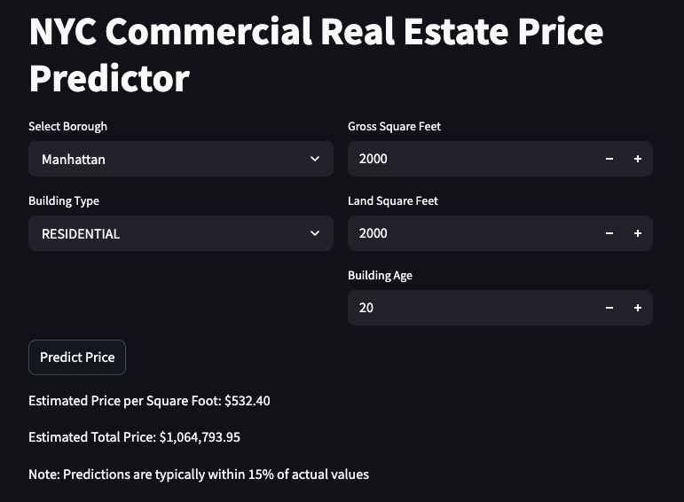

# NYC Real Estate Price Predictor

A machine learning model to predict commercial real estate prices in New York City. This project includes both the model training code and a user-friendly web interface for making predictions.



## Features

- Predicts price per square foot and total price for properties
- Covers all five NYC boroughs
- Accounts for multiple factors:
  - Property size (gross square feet)
  - Land size
  - Building age
  - Building type (Residential/Commercial/Other)
  - Location (Borough)
- User-friendly web interface built with Streamlit
- Model trained on NYC Department of Finance rolling sales data

## Model Performance

- Test R² Score: 0.3770
- Average prediction error: ~15%
- Key predictive features:
  - Property size
  - Location (Borough)
  - Building age
  - Land-to-building ratio

## Installation

1. Clone the repository:
```bash
git clone https://github.com/yourusername/nyc-real-estate-predictor.git
cd nyc-real-estate-predictor
```

2. Install required packages:
```bash
pip install -r requirements.txt
```

## Usage

1. Train the model:
```bash
python model_training.py
```

2. Run the web interface:
```bash
streamlit run app.py
```

3. Open your browser and go to `http://localhost:8501`

## Project Structure

```bash
nyc-real-estate-predictor/
├── assets/
│   ├── nyc-rolling-sales.csv
│   └── streamlit_interface.png
├── model_training.py
├── app.py
├── nyc_price_model.pkl
├── requirements.txt
└── README.md
```

## Data

The model is trained on the NYC Department of Finance Rolling Sales Data, which includes:

- Property sales prices
- Building characteristics
- Location information
- Usage type

## Model Details

- Algorithm: XGBoost Regressor
- Features engineered:
  - Log transformations of square footage
  - Building age categories
  - Commercial ratio
  - Land-to-building ratio
  - Units per square foot
